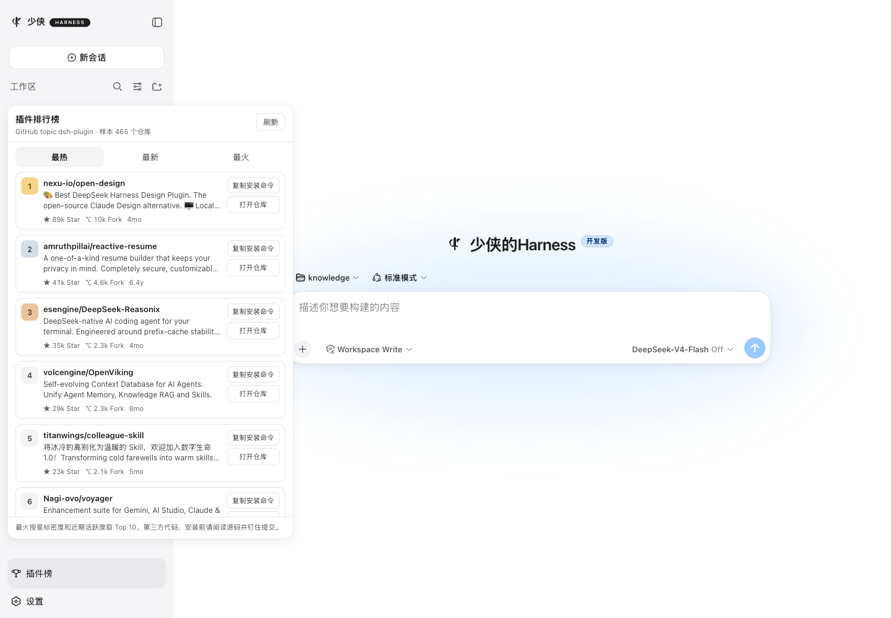

# dsh-plugin-leaderboard

[English](README.md) | 中文

DeepSeek Harness 社区插件排行榜。它读取 GitHub 公开话题 [`dsh-plugin`](https://github.com/topics/dsh-plugin)，并在 Web 界面里直接给出三份榜单：



| 榜单 | 含义 |
| --- | --- |
| **最热** | 按 GitHub star 从高到低 |
| **最新** | 按仓库创建时间从新到旧 |
| **最火 Top 10** | 按星标密度和近期活跃度取前 10 |

## 安装

```sh
dsh plugin --profile web add github:shaoxia20240902/dsh-plugin-leaderboard
```

本地目录：

```sh
dsh plugin --profile web add /path/to/dsh-plugin-leaderboard
```

重启 `dsh web`。侧边栏底部会出现 **插件榜**。会话里也可以输入 `/leaderboard`，或者让智能体报最热 / 最新 / 最火的插件。

## 你会看到什么

- **侧边栏面板**：三个页签、star / fork、复制安装命令、打开仓库。
- **斜杠命令** `/leaderboard [hot|new|fire]`。
- **工具** `list_dsh_plugin_leaderboard`，智能体可直接查榜。
- **HTTP** `GET /dsh-plugin-leaderboard`（面板走这条同源接口）。

这些仓库都是第三方代码。安装前请阅读源码，并用 `github:owner/repo#<sha>` 钉住提交。

## 排名规则

- **最热** — 按 `stargazers_count` 降序。
- **最新** — 按 `created_at` 降序。
- **最火** — `(stars + 0.5 * forks) / 上线天数 * (1 + 7 / (距上次更新天数 + 1))`，取 Top 10。

目录会合并若干页 GitHub 搜索（按 star、按最近更新），并去掉 `deepseek-ai/deepseek-harness`、fork 和已归档仓库。成功结果缓存 10 分钟。

## 配置

可在 profile 的 `cordis.patch.yml` 里覆盖 `dsh-plugin-leaderboard` 行：

```yaml
- id: dsh-plugin-leaderboard
  config:
    githubToken: # 也可设环境变量 GITHUB_TOKEN / GH_TOKEN
    topic: dsh-plugin
    cacheTtlMs: 600000
    starPages: 3
    updatedPages: 2
    excludes:
      - deepseek-ai/deepseek-harness
```

个人使用可以不配 token。刷新很勤时再配，以免撞上 GitHub 匿名限额。

## 开发

```sh
pnpm install
pnpm test
pnpm build
```

运行时入口是 `lib/`。浏览器半区是 `lib/client.js`，由 Web GUI 的模块表加载。

## 许可证

MIT
